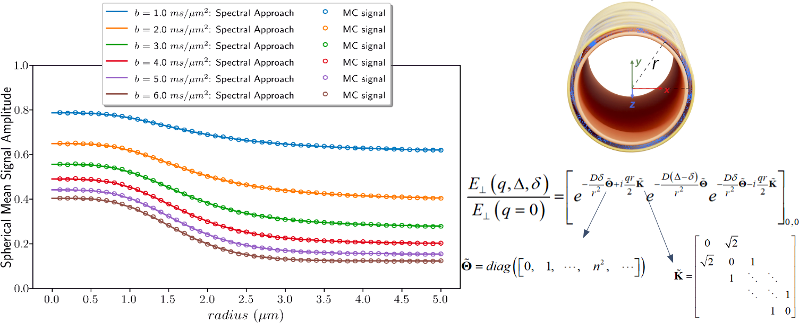

# Exact analytical diffusion MRI signal for diffusion confined to a cylindrical surface using a spectral Laplacian formalism



---
This repository contains the models, synthetic data, and scripts described in our 2026 manuscript:

**"Exact analytical PGSE signal for diffusion confined to a cylindrical surface using a spectral Laplacian formalism"**

*Erick J. Canales-Rodríguez, Chantal M. W. Tax, Juan Manuel Górriz, Derek K. Jones, Jean-Philippe Thiran, Jonathan Rafael-Patiño*

## Summary

This repository implements an exact analytical model for the diffusion MRI signal arising from diffusion confined to a cylindrical surface under finite rectangular pulsed-gradient spin-echo (PGSE) gradients.

The Bloch–Torrey equation is solved using a spectral matrix formalism based on the eigenfunctions of the Laplace operator on the cylindrical surface. The resulting dMRI signal is expressed as a product of non-commuting matrix exponentials and is valid for arbitrary rectangular gradient durations and separations, without approximations to the diffusion propagator or spin phase distribution.

The repository also includes computationally efficient strategies for repeated signal evaluations, including:

- a reduced real spectral basis,
- Strang splitting,
- Gauss–Legendre quadrature for computing the spherical mean.

The analytical signal is validated against Monte Carlo diffusion simulations.

## Repository Structure 📖

### `Data/`

Contains the synthetic datasets used for validation.

To extract the datasets, unzip the provided `Data.zip` file:

```bash
unzip Data.zip -d Data/
  
## Main Directory and Usage 🚀
The main directory contains Python scripts used to reproduce figures, numerical analyses, and validation experiments reported in the manuscript.
For example:

    python3 run_Fig2_Spherical_mean_signal_vs_Radius_Monte_Carlo_Signal_vs_Spectral_Approach_G500_D0.8_6bvalues.py
    
## Getting Started - dependencies 🔧
The scripts require:
```
-Python 3.8+
-NumPy
-Matplotlib
-SciPy
```

## Installation 🎁
Clone the repository and navigate to its directory:

    git clone https://github.com/ejcanalesr/exact-PGSE-dMRI-signal-cylindrical-surface.git
    cd exact-PGSE-dMRI-signal-cylindrical-surface

## License 📄
This project is licensed under the Creative Commons Attribution 4.0 International (CC BY 4.0) public copyright license.

## Contact 📧
For questions or suggestions, contact Erick J. Canales-Rodríguez

    Emails: ejcanalesr@ugr.es
